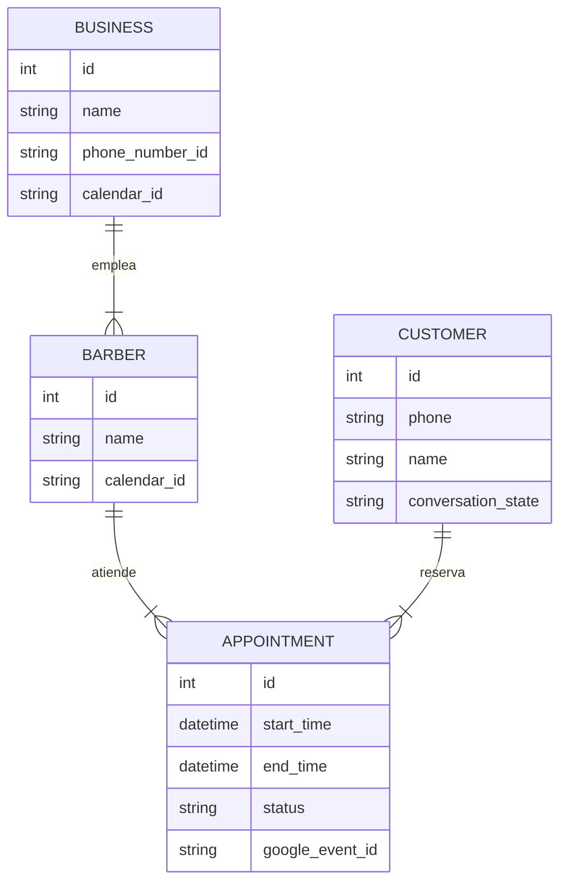

# 🗄️ Estructura de Base de Datos

El proyecto utiliza **PostgreSQL** (vía Neon.tech) como base de datos relacional y **SQLAlchemy** como ORM (Object Relational Mapper) para manipular los datos desde Python.

## 🗺️ Diagrama Entidad-Relación (ERD)

## 📚 Diccionario de Datos

### 1. `businesses` (Negocios)
Representa la peluquería o local.
-   **id**: Identificador único.
-   **name**: Nombre del negocio.
-   **phone_number_id**: ID de WhatsApp Business API asociado.
-   **calendar_id**: (Opcional) Calendario "Master" de Google donde van todas las copias de las citas.
-   **open_hour / close_hour**: Horario de apertura (enteros, formato 24h).

### 2. `barbers` (Profesionales)
Son los empleados o recursos que se pueden reservar.
-   **name**: Nombre que ve el cliente en el menú.
-   **calendar_id**: ID del Google Calendar **personal** de este barbero. Aquí es donde el bot revisa disponibilidad y crea los eventos.

### 3. `customers` (Clientes)
Usuarios que escriben por WhatsApp.
-   **phone**: Número de teléfono (ID único de usuario).
-   **conversation_state**: "Memoria" del bot. Indica en qué paso está (ej: `SELECT_DATE`).
-   **conversation_data**: JSON temporal para guardar datos mientras se completa la reserva (ej: `{"barber_id": 1, "date": "2023-10-20"}`).

### 4. `appointments` (Citas)
Registro histórico de las reservas.
-   **status**: `pending` (reservado), `cancelled`, `completed`.
-   **google_event_id**: ID del evento en Google Calendar (para poder borrarlo o moverlo después).
-   **reminded_24h / reminded_1h**: Flags para saber si ya se enviaron los recordatorios automáticos.
