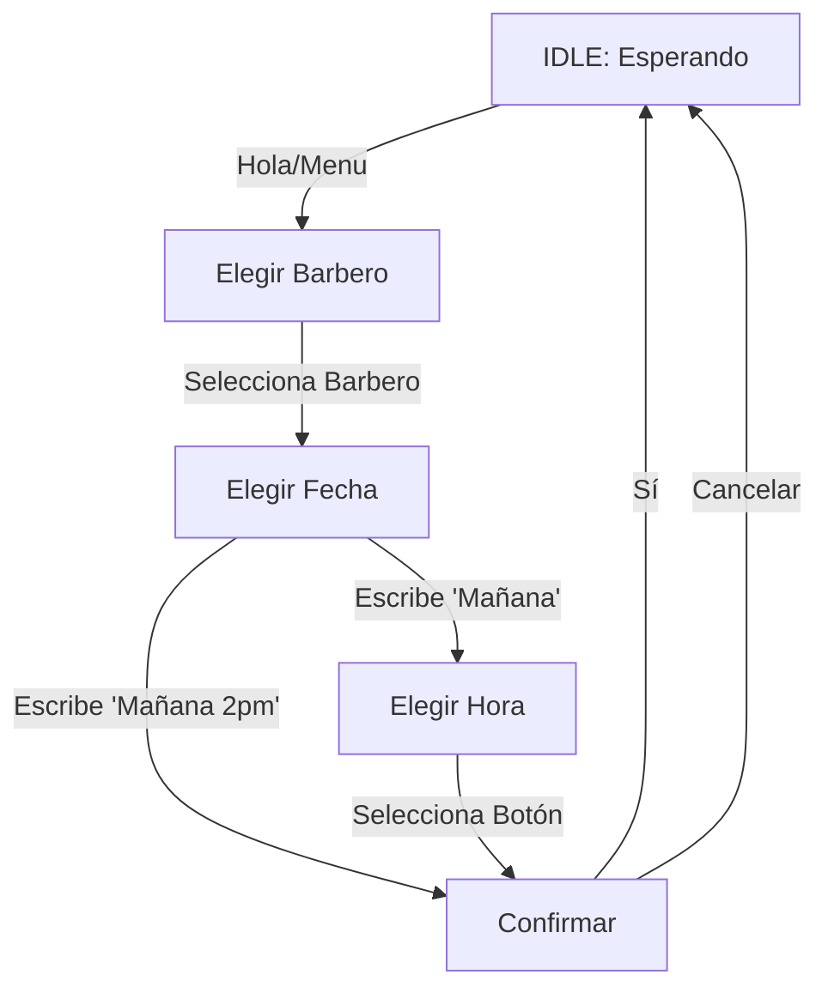

# 🔄 Flujo de Usuario (User Flow)

Este documento explica cómo interactúa un cliente con el Bot de Citas a través de WhatsApp. El sistema funciona como una **Máquina de Estados**, lo que significa que el bot recuerda en qué paso de la conversación está cada usuario.

## 📊 Diagrama de Estados (Resumen)

## 📝 Descripción Paso a Paso

### 1. Estado Inicial (`IDLE`)
El usuario no tiene ninguna conversación activa.
-   **Acción del Usuario**: Escribe "Hola", "Agendar", "Menu".
-   **Respuesta del Bot**: Muestra el menú de bienvenida con la lista de profesionales (barberos) disponibles.
-   **Cambio de Estado**: Pasa a `SELECT_BARBER`.

### 2. Selección de Profesional (`SELECT_BARBER`)
El bot espera que el usuario elija con quién quiere atenderse.
-   **Interfaz**: Botones interactivos con los nombres de los barberos.
-   **Acción del Usuario**: Presiona un botón (ej: "Juan").
-   **Respuesta del Bot**: "¿Para qué día te gustaría la cita? (Ej: Hoy, Mañana, Lunes...)".
-   **Cambio de Estado**: Pasa a `SELECT_DATE`.

### 3. Selección de Fecha (`SELECT_DATE`)
El bot usa Inteligencia Artificial (NLP) para entender fechas en lenguaje natural.
-   **Acción del Usuario**: Escribe "Mañana", "El viernes", "20/10".
    -   *Opción A (Solo Fecha)*: "Mañana". El bot busca huecos libres y muestra botones con horas. -> Pasa a `SELECT_SLOT`.
    -   *Opción B (Fecha y Hora)*: "Mañana a las 2pm". El bot verifica si esa hora exacta está libre. -> Pasa a `CONFIRM_BOOKING`.

### 4. Selección de Hora (`SELECT_SLOT`)
Si el usuario no especificó la hora, el bot le muestra opciones.
-   **Interfaz**: Botones con horarios disponibles (ej: "09:00", "10:00").
-   **Acción del Usuario**: Elige un horario.
-   **Cambio de Estado**: Pasa a `CONFIRM_BOOKING`.

### 5. Confirmación (`CONFIRM_BOOKING`)
Paso final para evitar errores.
-   **Interfaz**: Muestra el resumen (Profesional, Día, Hora) y dos botones: "Sí, agendar" / "Cancelar".
-   **Acción del Usuario**: Confirmar.
-   **Proceso Interno**:
    1.  Crea el evento en Google Calendar del barbero.
    2.  Guarda la cita en la base de datos local (`appointments`).
    3.  Envía confirmación por WhatsApp.
-   **Cambio de Estado**: Vuelve a `IDLE`.

---

## 🤖 Casos Especiales

### Cliente Nuevo (`ASK_NAME`)
Si es la primera vez que un número escribe:
1.  El bot detecta que no existe en la base de datos.
2.  Entra en estado `ASK_NAME`.
3.  Pregunta: "¿Cuál es tu nombre?".
4.  Guarda el nombre y continúa el flujo normal.

### Modo Silencioso
En estado `IDLE`, si el usuario escribe algo que NO es un saludo (ej: "Jajaja ok"), el bot lo ignora para no ser molesto. Solo responde a palabras clave (`hola`, `cita`, `agendar`).
